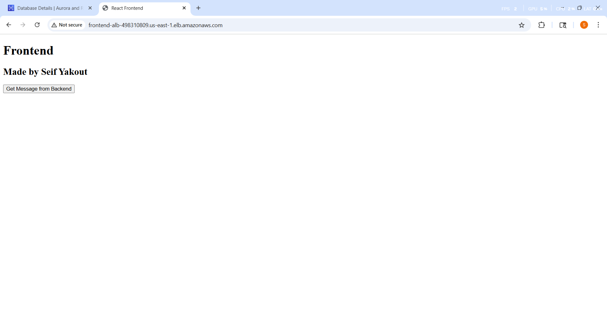
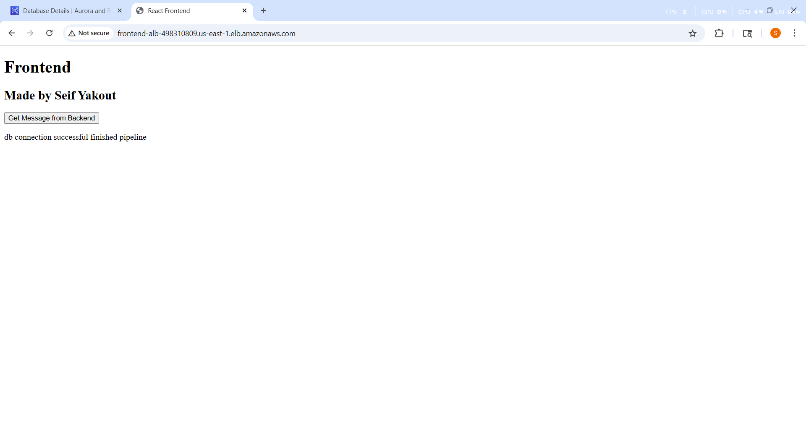

# 🚀 AWS-3-Tier-Web-Architecture 🚀


## 🪄 Project Overview

This project demonstrates the implementation of a 3-tier architecture using AWS services, with a focus on automation through **Terraform** for infrastructure management. The project is designed to host a scalable web application, consisting of a **Frontend**, **Backend**, and **Database** tier, ensuring high availability and performance. 

The backend uses an **ALB (Application Load Balancer)** to distribute traffic, and the application interacts with an **RDS database** to persist data.

## 🎯 Objectives

- **Automation**: The infrastructure is fully automated using **Terraform**, allowing for easy provisioning and management of resources.
- **Security**: The application uses security best practices, including proper security groups, IAM roles, and encryption for sensitive data.
- **Scalability**: The application is designed to scale automatically based on traffic demand using **AWS Auto Scaling Groups**.
- **High Availability**: The system is built for high availability, ensuring that even if one part of the system fails, the application continues to operate seamlessly.
- **Cost Optimization**: The architecture is designed to use **AWS Free Tier** services where possible, keeping costs low during development and testing.


## 👷🏻‍♂️ Architecture Diagram


## 🔑 Key Features and Services
### Amazon VPC (Virtual Private Cloud)
**Purpose:** To isolate and secure the infrastructure within a dedicated network to ensure secure communication between the frontend, backend, and database tiers.
**Features:**
- Configured a custom VPC with:
-   Public Subnet [**Frontend Tier**]: For hosting the Bastion Host, Frontend EC2 Instances, NAT Gateway and External Load Balancer.
-   Private Subnet [**Backend Tier**]: For hosting application EC2 instances.
-   Private Subnet [**Database Tier**]: For hosting database on RDS.
- NAT Gateway: Allowed instances in private subnets to access the internetsecurely.
- Route Tables: Configured for proper routing between subnets and internet-bound traffic.
- **Security Groups**: Control inbound and outbound traffic to the instances and the database, ensuring proper security.
### Frontend
- **Amazon EC2**: Hosts the frontend application, serving static content (HTML, CSS, JS) and interacting with the backend through API calls through Internal Load Balancer.
- **Nginx**: Configured as a reverse proxy, routing API calls from the frontend to the backend ALB (Application Load Balancer).
- **AWS Auto Scaling Group (ASG)**: Automatically scales the number of EC2 instances based on traffic demand.

### Backend
- **Amazon EC2**: Runs the backend application (Node.js) and communicates with the RDS database.
- **Application Load Balancer (ALB)**: Distributes incoming traffic to the backend EC2 instances to balance the load.
- **AWS Auto Scaling Group (ASG)**: Ensures that the backend EC2 instances scale according to traffic and load.

### Database
- **Amazon RDS**: Hosts the MySQL database, ensuring automatic backups, patching, and scaling.
  
## 👨🏻‍💻 Technologies Used
- **Terraform**: Used for provisioning and managing the AWS infrastructure. This includes creating EC2 instances, ALB, ASG, RDS, and security configurations.
- **Amazon Web Services (AWS)**: Core cloud provider used to host the application.
- **Node.js**: Backend framework used to run the backend service.
- **Nginx**: Web server used as a reverse proxy.
- **GitHub**: Used for version control and collaboration.
## 🧱 Project Structure

```
.
└───modules
    ├───ALB
    │       External-ALB.tf
    │       Internal-ALB.tf
    │       output.tf
    │       variables.tf
    │
    ├───ASG
    │   │   BackEnd-ASG.tf
    │   │   BackEnd-temp.tf
    │   │   FrontEnd-ASG.tf
    │   │   FrontEnd-temp.tf
    │   │   variables.tf
    │   │
    │   └───UserData
    │           backend.sh.tpl
    │           frontend.sh.tpl
    │
    ├───EC2
    │       BastionHost.tf
    │       config.sh
    │       output.tf
    │       variables.tf
    │
    ├───RDS
    │       main.tf
    │       output.tf
    │       variables.tf
    │
    ├───SecurityGroups
    │       main.tf
    │       outputs.tf
    │       variables.tf
    │
    └───VPC
            main.tf
            output.tf
            variables.tf

```

---

## 📷 Project Screenshots

### FrontEnd



The Frontend user interface displays user interactions. When the button is clicked, it sends a request to the RDS service to retrieve or modify data.

### BackEnd


The Backend system manages incoming requests and communicates with the RDS. This demonstrates the server-side operations that support the frontend's functionality.

## ⁉️ Challenges Faced

### 1. Security Groups and VPC Setup
Configuring security groups and VPC settings using terraform required a deeper understanding of networking in AWS.

### 2. Automating EC2 and RDS Configuration
Automating the setup for **EC2 instances** and **RDS databases** was a challenge, particularly with connecting the instances together Frontend and Backend instances as well as Backend instances to the RDS database.

### 3. Debugging User Data Script
Initially, the **user data script** for the EC2 instances was not running as expected. Adding logging helped identify missing dependencies and misconfigured settings.


## 🌟 Future Improvements
- **Configuration Management with Ansible**: Introducing Ansible for automating configuration management and deployments across the infrastructure. 
- **CI/CD Pipeline**: Integrating a **CI/CD** pipeline to automate testing, building, and deploying the application.
- **Monitoring and Alerts**: Setting up **CloudWatch** alarms for better monitoring of EC2 instance health and resource utilization.
- **Containerization with Docker**: Moving towards containerized services using **Docker** for better scalability and ease of deployment.
